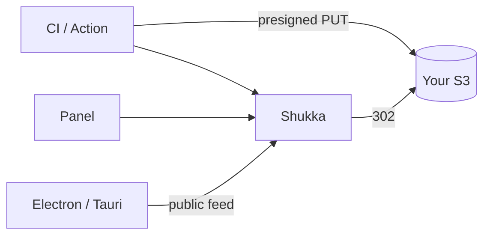

<p align="center">
  
</p>

<h1 align="center">Shukka</h1>

<p align="center">
  Self-hosted updates for Electron and Tauri.<br>
  Your bucket. Your feed. Your panel.
</p>

<p align="center">
  <a href="https://github.com/shukka-app/shukka/blob/main/LICENSE"></a>
  <a href="https://github.com/shukka-app/shukka/pkgs/container/shukka"></a>
  <a href="https://github.com/shukka-app/shukka/releases"></a>
  <a href="https://github.com/shukka-app/shukka/actions/workflows/ci.yml"></a>
</p>

Create an app, point it at a bucket, and Shukka gives you a public update feed
per channel, API keys for CI, and a record of every version you have shipped.

Desktop clients keep using `electron-updater` or Tauri plugin-updater. Installers
never transit the Shukka process — they go straight to your S3-compatible storage.

## What it does

| | |
| --- | --- |
| **Panel** | Apps, channels, versions, and download counts behind a single admin password. |
| **Your storage** | Each app carries its own S3 settings, so AWS, Cloudflare R2, and MinIO can coexist. |
| **Direct uploads** | Installers go from CI to S3 over presigned URLs. Shukka never proxies the bytes. |
| **Public Electron feed** | `electron-updater` reads `/api/update/{app}/{channel}` with no credentials. Metadata is served byte-for-byte as `electron-builder` wrote it. |
| **Public Tauri feed** | plugin-updater reads JSON at the same URL. |
| **GitHub Action** | One step publishes an `electron-builder` or Tauri output directory. |
| **Drafts by default** | Finalize leaves a draft. Promote — or pass `release: true` — before users see it. |
| **Agent skill** | `.agents/skills/shukka-ops/` teaches an agent to drive the API. |



## Run it

```bash
docker run -d --name shukka -p 3000:3000 -v shukka-data:/data ghcr.io/shukka-app/shukka
```

Or the Compose example (Shukka + a local MinIO for the panel wizard):

```bash
docker compose -f deploy/compose.yaml up -d
docker exec minio mkdir -p /data/releases
```

Ansible copies that same file onto a host and waits for `/api/health`:

```bash
ansible-playbook -i inventory.ini deploy/ansible/playbook.yml
```

Pushing a `vMAJOR.MINOR.PATCH` tag publishes that image to GitHub Packages. Pin a
version with `ghcr.io/shukka-app/shukka:0.1.1` if you do not want `latest`.

Or from source:

```bash
npm ci
npm run build
npm start          # http://localhost:3000
```

Open the panel and set the admin password on first visit. Everything Shukka persists —
the SQLite database and `encryption.key` — lives in `/data` (`SHUKKA_DATA_DIR`,
default `./data`). Back up that whole directory. Restore is copy the directory back;
a database without the key cannot decrypt stored S3 secrets.

`GET /api/health` is the liveness probe (`200 { status: "ok", db: "ok" }`, or
`503` when SQLite is down). The image runs as `node` and health-checks that path.

Forgot the admin password: delete the singleton `admin` row (`id = 1`) and reopen
`/setup`. That is the ADR recovery path (`docs/adr/auth-model.md`) — there is no
reset CLI.

Full operator guide — reverse proxy, backups, upgrades, env vars, what not to host on: [`docs/prd/deploy.md`](docs/prd/deploy.md). Compose and Ansible examples: [`deploy/compose.yaml`](deploy/compose.yaml), [`deploy/ansible/playbook.yml`](deploy/ansible/playbook.yml).

| Variable | Default | Purpose |
|----------|---------|---------|
| `PORT` | `3000` | HTTP port |
| `SHUKKA_DATA_DIR` | `./data` | Database and encryption key location |
| `SHUKKA_DB_PATH` | `{data}/shukka.db` | Override the database file |
| `SHUKKA_SECURE_COOKIES` | unset | Set `1` to force `Secure` on the session cookie (or terminate TLS and forward `X-Forwarded-Proto: https`) |

## Publish a release

Create an app in the panel, then an API key on its **API keys** tab. In CI:

```yaml
- uses: shukka-app/shukka@v1.0.2
  with:
    server-url: ${{ secrets.SHUKKA_URL }}
    api-key: ${{ secrets.SHUKKA_API_KEY }}
    app: my-app
    channel: stable
    directory: dist
    release: true   # omit to create a draft the feed cannot see; promote in the panel or PATCH .../channels/{channel} {"currentVersion":"…"}
```

Point the whole `electron-builder` `dist/` or Tauri `src-tauri/target/release/bundle`
directory at it. Electron: installers, `.blockmap`, `latest*.yml` (version from the yml).
Tauri: updater artifacts + matching `.sig` under `bundle/` or a platform subdir;
`latest.json` is optional (version from this input, then `latest.json`, then the nearest
`tauri.conf.json`, then a `_1.0.0_` token in the filename).

Outside GitHub Actions, the same uploader runs standalone:

```bash
SHUKKA_SERVER_URL=https://updates.example.com \
SHUKKA_API_KEY=shk_… \
SHUKKA_APP=my-app \
SHUKKA_DIRECTORY=dist \
node scripts/shukka-upload.mjs
```

## Point the app at the feed

The **Integration** tab prints these with your real URLs filled in.

**Electron**

```yaml
# electron-builder.yml
publish:
  provider: generic
  url: https://updates.example.com/api/update/my-app/stable
```

**Tauri**

```json
{
  "plugins": {
    "updater": {
      "endpoints": ["https://updates.example.com/api/update/my-app/stable"]
    }
  }
}
```

Uploads are atomic: until `finalize` succeeds — and, by default, until the version is
promoted or finalized with `release: true` — the channel keeps serving the previous
release, so a half-finished upload never reaches a user.

## Develop

```bash
npm run dev        # panel + API on :3000
npm run check      # lint, typecheck, tests
npm run db:generate # regenerate migrations after editing src/db/schema.ts
```

The GitHub Action is a JavaScript action (`using: node24`) so it does not need
bash — Windows self-hosted runners with only MinGit work. It is linted with
[actionlint](https://github.com/rhysd/actionlint). Ubuntu CI matrices MinIO and
the JuiceFS S3 gateway; Windows action e2e stays on MinIO. See
`.github/workflows/ci.yml`, `.github/workflows/action-test.yml`, and
`.github/workflows/docker-test.yml` (image build + container flows, no push).

## Documentation

User-facing docs live in [`shukka-app/docs`](https://github.com/shukka-app/docs).
In-repo notes:

| Path | Contents |
|------|----------|
| `docs/prd/` | Product requirements |
| `docs/prd/deploy.md` | Self-host the Shukka server |
| `deploy/compose.yaml` | Compose example (Shukka + MinIO) |
| `deploy/ansible/playbook.yml` | Ansible playbook for that Compose file |
| `docs/adr/` | Architecture decisions and their trade-offs |
| `docs/spec.md` | Terminology, HTTP contracts, system invariants |
| `.agents/skills/shukka-ops/references/api.md` | Full API reference |

## License

[MIT](LICENSE)
